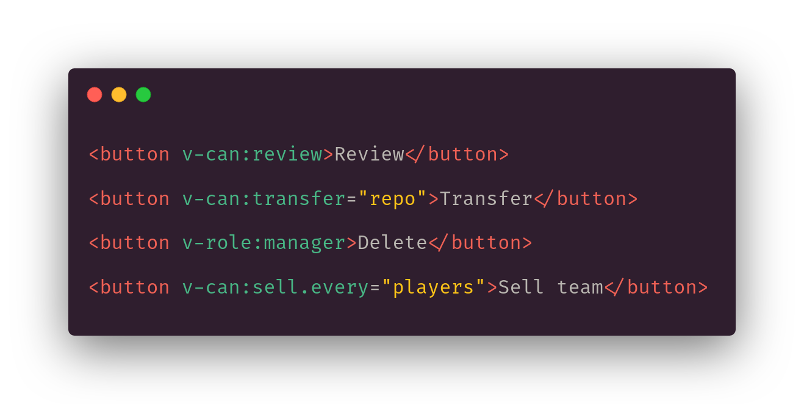

# vue-browser-acl 🔒

[](http://travis-ci.org/mblarsen/vue-browser-acl)
[](https://codebeat.co/projects/github-com-mblarsen-vue-browser-acl-master)
[](https://snyk.io/test/github/mblarsen/vue-browser-acl)
[](https://www.npmjs.com/package/vue-browser-acl)
[](https://www.npmjs.com/package/vue-browser-acl)
[](https://github.com/mblarsen/vue-browser-acl/blob/master/LICENSE)

> Easy user access control in Vue for better UX. Build on top of the [browser-acl](https://github.com/mblarsen/browser-acl) package.

- Easily manage permissions with
  [browser-acl](https://github.com/mblarsen/browser-acl) using rules and/or
  policies (rules using classes)
- Adds `v-can` directive with simple syntax:
  - `v-can:edit="post"` an instance on the component
  - `v-can:create="'Post'"` (the type)
  - `v-role:manager` (alias, for better semantic)
- Optionally adds `$can` and `$can.not` helper functions
- Can **hide** `v-can` or to just **disable** `v-can.disable` a section, tab,
  or button
- Works collections of objects `v-can.some` or `v-can.every`
- Works with **vue-router** to guard routes
- Works with **vuex** and plain objects
- 2.5kb zipped

For more background on the "syntax design" read this short article: [Vue user permissions through directives](https://blog.cheesefi.com/blog/vue-user-permissions-through-directives/).

[](https://www.codementor.io/@mblarsen?refer=badge)

## Examples



Similar to v-if removes button if user does not have permission to transfer
repo.

```vue
<button v-can:transfer="repo">Transfer</button>
```

You don't need a verb-object (see [global rules](#global-rules)).

```vue
<button v-can:review>Review</button>
```

Has a default alias, but you can customize it.

```vue
<button v-role:manager>Delete</button>
```

Disables button if user does not have permission to transfer repo, or make it
read-only if user cannot edit a post.

```vue
<button v-can:transfer.disable="repo">Transfer</button>
<input v-can:edit.readonly="post" type="text" name="title" />
```

It works on collections, e.g. the table is shown is the user can edit at least
some of the items.

```vue
<table v-can:edit.some="players"></table>
```

Or all of them.

```vue
<button v-can:sell.every="players">Sell team</button>
```

Additionally you can use the string and array syntax.

```vue
<button v-can="'transfer repo'">Transfer repo instance</button>
<button v-can="'create Repo'">Transfer based on class</button>
<button
  v-can="['transfer', repo, otherArgs]"
>Transfer with extra argument</button>
```

See `examples` for more detailed examples: routing, vuex, etc.

## Install

```
npm i vue-browser-acl
```

## Setup

```javascript
import Vue from 'vue'
import Acl from 'vue-browser-acl'

// example user from backend, you can provide a function
// instead in case the user retrieved asynchronously
// const user = () => store.auth.user
const user = window.__INITIAL_STATE__.user

Vue.use(Acl, user, (acl) => {
  acl.rule('view', Post)
  acl.rule(['edit', 'delete'], Post, (user, post) => post.userId === user.id)
  acl.rule('moderate', Post, (user) => user.isModerator())
})
```

You can pass in an actual user or a function that returns the users. This is
useful if you don't have the user available right away if for instance it is
fetched asynchronously.

The second param is a callback that let's you define the rules. Alternatively
you can pass a [preconfigured
acl](https://github.com/mblarsen/browser-acl#setup) from the `browser-acl`
package. This may be the better choice depending on your source bundling
approach.

See [browser-acl setup](https://github.com/mblarsen/browser-acl) for how to
define rules and policies (rules using classes).

As an optional third parameter you can pass an [options](#options) object.

> **Attention**: When using packagers such as _webpack_ or _rollup_ your code is
optimized in a way that requires you to register your rules in a safer way.
Make you sure you read through the [verb-object-mapping section](https://github.com/mblarsen/browser-acl#best-practice).
In short it encourges you to use the [`acl.register` function](https://github.com/mblarsen/browser-acl#register)
to register your models explictly, so that however the packager mangles your 
variables the code will still work in production.

### Plain objects vs function/class

The above describes setup in applications where you use ES6 classes or named
constructor functions to represent your models. If you use plain objects,
however, you'll have to provide a function that maps the input to string
representation of what the object is.

In this example it is assumed that you have a property type on your object:

```javascript
acl.verbObjectMapper = (s) => (typeof s === 'string' ? s : s.type)
```

E.g. a post:

```javascript
{
    type: 'Post',   // <-- this would be used to determine what rules to apply
    title: 'ACL in the front-end',
    author: 'Wow 🦀'
}
```

See the details in browser-acl [verb-object mapper section](https://github.com/mblarsen/browser-acl#verb-object-mapping).

## Usage

You can use the module as directive, with vue-router, and as a helper function.

The `v-can` directive can be used in three different flavors and you can apply
one or more modifiers that alters the behavior of the directive.

There are three different flavors, that to some degree can be mixed: array,
string, and argument. For most cases the _argument flavor_ would be the
preferred syntax.

### Array flavor

Verb, object and optional parameters are passed as an array as the value for
the directive.

```vue
<button v-can="['create', 'Post']">New</button>
<button v-can="['edit', post]">Edit</button>
<button v-can="['delete', comment, post]">Delete</button>
```

<details>
All arguments from the third and onwards will be passed to the ACL for evaluation.

Pros:

- Let's you pass additional arguments
- The vue compiler throws errors if you use something that doesn't exist on the
  component

Cons:

- Doesn't read so easily when skimming the markup
</details>

### String flavor

Verb and object is combined in a string like `create Post` or `edit post` which makes
up the value of the directive.

```vue
<button v-can="'create Post'">Create</button>
<button v-can="'edit post'">Edit</button>
```

<details>
The string `create Post` is interpreted as the verb 'create' on the object with name
'Post' (a class name).  The string `edit post` is interpreted as the verb 'edit' on
the verb-object that is a property on the component.

Pros:

- Easy to read

Cons:

- Cannot take additional arguments
- Since the value is a string you lose the vue-compiler errors if you refer to something
that doesn't exist.
</details>

### Argument flavor

In this flavor the verb is passed as an argument to the directive and for the value can
use either string or array flavor with the verb removed. Additionally the value can be a
plain verb-object object as well.

```vue
<button v-can:review>Review</button>
<button v-can:create="'Post'">New</button>
<button v-can:edit="'post'">Edit</button>
<button v-can:edit="post">Edit</button>
<button v-can:delete="[comment, post]">Delete</button>
```

<details>
Pros:

- Easy to read for simple cases
- Flexible value syntax
- The vue compiler throws errors if you use something that doesn't exist on the component

Cons:

- Can be slightly harder to comprehend as you make use of modifiers.

</details>

### Modifiers

There are a few modifiers. Three that affects the element (hide, disable, readonly) and two that let's
you evaluate multiple verb-objects at once (some, every).

```vue
<button v-can.disable="'delete post'">Delete</button>
<button v-can:delete.disable="post">Delete</button>
<button v-can:delete.disable.some="posts">Delete</button>
```

Modifiers are applied after the directive (first line) or argument (second line) and
separated by a dot (third line) if several modifiers are used.

#### `hide` modifier

The hide modifier is also the default behavior so there is no need to apply it unless you
want to explicitly state the behavior. It works like `v-if` by removing the component from
the DOM.

```vue
<button v-can="'delete post'">Delete</button>
<button v-can.hide="'delete post'">Delete</button>
```

The above two lines has the same effect.

#### `disable` modifier

The disable modifier applies the `disabled` attribute to the tag, e.g. to disable a button that
you are not allowed to use.

```vue
<button v-can.disable="'delete post'">Delete</button>
```

#### `readonly` modifier

The read only modifier applies the `readonly` attribute to the tag, e.g. to
make an input read only if you don't have permission to edit.

Note: The `readonly` attribute doesn't work on all inputs. Checkboxes for
instance doesn't support it.

#### `not` modifier

The not modifier reverses the query. In this example only if you cannot delete the job the div
element is shown.

```vue
<div v-can:delete.not="job">Ask someone with permission to delete job</div>
```

#### `some` and `every` modifiers

The `some` and `every` arguments takes multiple verb-objects and will apply the
same verb to all of them.

```vue
<table v-can.some="['edit', players]">
  <button v-can:sell.every="players">Sell team</button>
  <button v-can:delete.some="[project, sprintBoard]">Delete</button>
</table>
```

Note that the verb-objects do not need to be the some kind. In the third example
above the delete button becomes visible if you either have delete permission on
the project (think project owner) or you have it on the sprint board itself (a
user with less permissions).

See [browser-acl](https://github.com/mblarsen/browser-acl) for more info on how
to use them.

#### `global` modifier

The global modifier explicitly tells the plugin that you mean to address
a global rule. In most cases this can be left out.

```vue
<!-- implicit -->
<button v-can:review>Review</button>
<button v-can="'review'">Review</button>

<!-- explicit -->
<button v-can="`review ${GlobalRule}`">Review</button>
<button v-can.global="'review'">Review</button>
```

### Helper

You can also use the helper function `$can` that works much in the same way:

```vue
<settings-table :editable="$can('update', 'Setting')" :settings="settings" />
```

or

```javascript
if (this.$can('edit', post)) {
  axios.put(`/api/posts/${post.id}`, post)
}
```

You can negate `$can` with `$can.not`.

If you don't want to install the helper function pass `helper: false` in the
options.

### vue-router

There are two ways to hook up the vue-router. Either during setup of the Acl or
later calling the router init funtion.

<details>
  <summary>Option 1: setup</summary>

```javascript
Vue.use(Acl, user, (acl) => {
    ..
}, {router});
```

</details>

<details>
  <summary>Option 2: init function</summary>

```javascript
acl.router(router)
```

</details>

You configure routes by adding `can` meta property to the route. E.g. if a
router requires create permissions for "Post":

```javascript
{
  name: 'new-post',
  path: 'posts/create',
  component: PostEditor,
  meta: {
    can: 'create Post',
    fail: '/posts'
  }
}
```

Limitation: Unlike with the directive and the helper you will not have access
to class instances. E.g you cannot use a `can: 'delete post'` as this assumes
you have a Post instance already.

`role` is a synonym for `can`. So if you have rules that are more role-like you
can use this instead. E.g. `role: 'admin'`.

Async evaluation is possible providing a callback that returns a promise like
this:

```javascript
{
  path: 'posts/:postId',
  component: PostEditor,
  meta: {
    can: function (to, from, can) {
      return axios.get(/* fetch post async */)
        .then({post} => can('delete', post))
    },
    fail: '/posts'
  }
}
```

Normally it would be better to prevent this route from being visited in the first place. Also the
backend could perform a redirect. That said you have the option.

#### Default fail route

By default if you omit the 'fail' property from the a routes meta a failed
check will redirect to `/`. You can change this behaviour by setting the option
`failRoute`.

This is useful if you use the library in an authentication flow. E.g. by
setting it to `/login`.

You can also use an object for more options ([see guards section in docs](https://router.vuejs.org/en/advanced/navigation-guards.html)):

```
failRoute: {path: '/login': replace: true}
```

This will use replace rather than push when redirecting to the login page.

#### `$from`

You can set the failRoute to the special value `$from` which will return the user to wherever they came from

### Global rules

You can also use [global rules](https://github.com/mblarsen/browser-acl#additional-parameters-and-global-rules)
in your routes.

However when running in strict mode you have to be explicit about using these in your routes.

```javascript
{
  path: 'village/:villageId',
  component: Pillager,
  meta: {
    can: 'pillage'
  }
}
```

In strict mode:

```javascript
import {GlobalRule} from 'browser-acl'
...
{
  path: 'village/:villageId',
  component: Pillager,
  meta: {
    can: `pillage ${GlobalRule}`
  }
}
```

See options below.

## Options

### assumeGlobal

`default: true`

When true you can use [global rules](https://github.com/mblarsen/browser-acl#additional-parameters-and-global-rules)
in your routes without explicitly marking them as global.

Note: In strict mode this is turned of. You can override this by explicitly
setting assumeGlobal to true.

### acl

`default: {}`

Options object passed to the Acl contructor.

### caseMode

`default: true`

Assume case means that an upper case verb-object is the name of a class or a constructor function and that a lower case verb-object
is the component member name of an instance of that class.

E.g. if verb-object is `post` the directive will try to look up the data member `post` on the component.

If `caseMode` is set to false this behavior is disabled and `post` will be treated as a verb-object name.

### directive

`default: can`

The name of the directive. E.g. `can` produces a directive called `v-can` and a helper function called `$can`.

You'll most likely only use this if you want to replace this module with an existing one that uses a different name.

### failRoute

`default: /`

### helper

`default: true`

Adds `$can`, `$can.not`, `$can.some`, and `$can.every` helper function to the Vue prototype when `true`.

### router

`default: undefined`

Pass in a router instance if you want to make use of the ACL functionality in routers.

### strict

`default: false`

When set to true a route without `meta.can` will automatically fail. In addition the setting
will cascade to the Acl settings, making these equivalent:

```javascript
Vue.use(Acl, user, acl => {...}, {strict: true}}
Vue.use(Acl, user, acl => {...}, {strict: true, acl: {strict: true}}
```

You can override this behavior like this:

```javascript
Vue.use(Acl, user, acl => {...}, {strict: true, acl: {strict: false}}
```

## Related

These are related projects with different approaches:

- [`vue-kindergarten`](https://github.com/JiriChara/vue-kindergarten) uses a powerful sandbox pattern. Integrates with Nuxt.js
- [`vue-acl`](https://github.com/leonardovilarinho/vue-acl) rather than saying what you can do you tell what the role is needed to perform an action.
- [`casl-vue`](https://github.com/stalniy/casl/tree/master/packages/casl-vue)

## Contributors ✨

Thanks goes to these wonderful people ([emoji key](https://allcontributors.org/docs/en/emoji-key)):

<!-- ALL-CONTRIBUTORS-LIST:START - Do not remove or modify this section -->
<!-- prettier-ignore-start -->
<!-- markdownlint-disable -->
<table>
  <tr>
    <td align="center"><a href="https://www.codeboutique.com"><br /><sub><b>Michael Bøcker-Larsen</b></sub></a><br /><a href="https://github.com/mblarsen/vue-browser-acl/commits?author=mblarsen" title="Code">💻</a> <a href="https://github.com/mblarsen/vue-browser-acl/commits?author=mblarsen" title="Documentation">📖</a> <a href="#example-mblarsen" title="Examples">💡</a> <a href="https://github.com/mblarsen/vue-browser-acl/commits?author=mblarsen" title="Tests">⚠️</a></td>
    <td align="center"><a href="https://jasminexie.github.io"><br /><sub><b>Jasmine Xie</b></sub></a><br /><a href="https://github.com/mblarsen/vue-browser-acl/issues?q=author%3Ajasminexie" title="Bug reports">🐛</a> <a href="https://github.com/mblarsen/vue-browser-acl/commits?author=jasminexie" title="Code">💻</a></td>
    <td align="center"><a href="https://github.com/JasonLandbridge"><br /><sub><b>JasonLandbridge</b></sub></a><br /><a href="#maintenance-JasonLandbridge" title="Maintenance">🚧</a></td>
    <td align="center"><a href="http://arusahni.net"><br /><sub><b>Aru Sahni</b></sub></a><br /><a href="https://github.com/mblarsen/vue-browser-acl/issues?q=author%3Aarusahni" title="Bug reports">🐛</a> <a href="https://github.com/mblarsen/vue-browser-acl/commits?author=arusahni" title="Code">💻</a></td>
    <td align="center"><a href="https://github.com/thomaslichtdotnet"><br /><sub><b>thomaslichtdotnet</b></sub></a><br /><a href="https://github.com/mblarsen/vue-browser-acl/issues?q=author%3Athomaslichtdotnet" title="Bug reports">🐛</a> <a href="https://github.com/mblarsen/vue-browser-acl/commits?author=thomaslichtdotnet" title="Code">💻</a></td>
  </tr>
</table>

<!-- markdownlint-restore -->
<!-- prettier-ignore-end -->

<!-- ALL-CONTRIBUTORS-LIST:END -->

This project follows the [all-contributors](https://github.com/all-contributors/all-contributors) specification. Contributions of any kind welcome!
